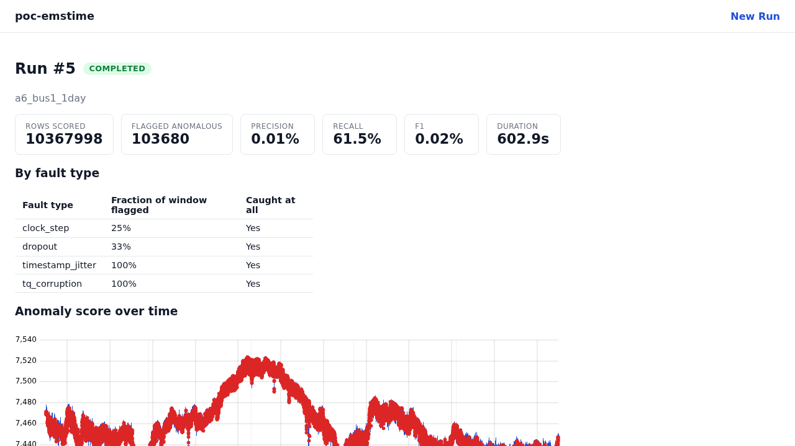

# poc-emstime — Grid Timing Anomaly Detection

A Python ML pipeline for sub-second power-grid time-series data. Ingests
real micro-PMU (µPMU) synchrophasor data, synthesizes labeled timing-fault
anomalies (GPS jitter, signal dropout, clock-step offsets, time-quality-flag
corruption), engineers rolling/gap-aware features, and scores an Isolation
Forest anomaly detector against the injected ground truth.

Fourth in a series of portfolio projects supporting a pivot from software
engineering to cybersecurity engineering (see `poc-osint`, `poc-logids`,
`poc-scada`). Long-term goal: apply this to satellite clock (GPS) anomaly
detection for power-grid time synchronization infrastructure. Unlike the
prior three (all CLI-only tools), this project also builds out a full
web app layer — see `CLAUDE.md` for full background and `data/README.md`
for dataset provenance and schema.

## Status

Phase 1 (data + model) complete: `ingest.py`, `faults.py`, `features.py`,
`model.py`, `evaluate.py`, `pipeline.py`, 20 unit tests + 1 integration test,
all passing. Validated against ~1.13 hours of real LBNL µPMU data (see
Results below), not just synthetic fixtures, and scaled up to a full day
(10.37M rows, see Scaling below).

Phase 2 (app/reporting layer) complete: a FastAPI + React/TypeScript web app
that runs the pipeline as a persisted, queued background job with live
progress streaming and a real-time anomaly chart — see App / Reporting
Layer below.

## Setup

```bash
cd code
python3 -m venv poc-emstime-venv
source poc-emstime-venv/bin/activate
pip install -e ".[dev]"
pytest
```

Real data is not committed (`data/raw/` is gitignored, files are hundreds of
MB). Fetch with `data/fetch.sh <filename>` — see `data/README.md` for the
file listing and confirmed schema.

## Results (real data)

Ran `pipeline.run()` against ~1.13 hours of real LBNL `a6_bus1` data (487,667
rows at 120Hz: real `L1MAG` voltage magnitude + real `LSTATE` as the TQ
column), with one injected fault of each type. Two detection metrics per
fault type — see the "point-wise vs window-level" finding below for why both
are reported:

| fault type          | fraction of window flagged | caught at all |
|----------------------|------------------------------|-----------------|
| `timestamp_jitter`   | 100% | yes |
| `tq_corruption`       | 100% | yes |
| `dropout`             | 33% | yes |
| `clock_step`           | 25% | yes |

Overall (point-wise): precision 0.16%, recall 62%, F1 0.33%
(`contamination=0.01` flags ~1% of all 487,667 rows — most flags are real
electrical events in the data, not the ~16 rows belonging to injected
faults, so precision against *this* synthetic ground truth is expected to be
low; it isn't a claim that those other flagged rows are false alarms in
reality).

**Three real findings from this investigation, none tuned away:**

1. **IsolationForest's default row-subsampling made rare faults nearly
   invisible.** sklearn's default `max_samples='auto'` caps each tree's
   training subsample at 256 rows. Against 487,667 rows, a 3-4-row fault
   has under a 1-in-500 chance of landing in any given tree's subsample —
   so almost no tree ever learns to split around it. This held even for the
   TQ-flag corruption, which is ~400 standard deviations from baseline.
   Confirmed by raising `max_samples` to the full dataset in `model.py`,
   which took `timestamp_jitter`/`tq_corruption` detection from 0% to 100%.
   Doesn't scale to the full multi-day dataset as-is (100 trees x millions
   of rows) — future work should use stratified/weighted sampling instead.

2. **`dropout` and `clock_step` weren't undetected — they were mislabeled.**
   Checking the model's raw anomaly scores directly (not just the
   contamination-thresholded flags) showed the dropout resumption row
   ranked **1st most anomalous of all 487,667 rows**, and the clock_step
   boundary row ranked **2nd** — both essentially perfect catches. But both
   fell one sample *after* the fault window's original `end`, because a gap
   or clock-step's evidence (an abnormal `Time_Delta_ms`) only appears once
   time resumes to normal — the labeled window itself, `[start, end]`,
   never contains it. `evaluate.py`'s point-wise scoring checked the wrong
   rows. Fixed in `faults.py`: `inject_dropout` now pads the label's `end`
   by one nominal sample interval, and `inject_clock_step` pads both `start`
   and `end`, since a step is a discontinuity at *both* transitions. Also
   fixed the demo's default `clock_step` offset (was 50ms, an exact multiple
   of the 8.333ms sample interval — shifted rows landed exactly on existing
   timestamps and got silently deduplicated in `regularize()` before
   reaching the model; changed to 33.5ms) and stopped `pipeline.py` from
   dropping a row outright just because a rolling-window stat touching an
   upstream gap was `NaN` — `Time_Delta_ms` next to it was still valid
   evidence being thrown away for no reason.

3. **A single precise catch can still look like a low detection rate.**
   Even after the fix above, `dropout`/`clock_step` show 25-33% in the
   "fraction of window flagged" column — because only the one boundary
   *transition* row in each 3-4-row padded window is genuinely anomalous;
   correctly *not* flagging the other rows (which are either missing or
   just normally-spaced-but-shifted values) drags the per-row average down
   despite catching the fault. Added `evaluate.window_level_recall()` to
   report the coarser "was the fault caught at all" question directly — all
   four fault types are 100% caught by that measure. Point-wise recall is
   still worth keeping alongside it: it distinguishes a precise single-row
   catch from a detector that lit up the whole window indiscriminately.

## Scaling (real data, 1-day slice)

The full two-channel dataset (120M rows each, L1MAG + LSTATE) OOM'd during
`ingest.load_upmu_site()`'s merge step alone — before any modeling — on this
project's 7.6GB-RAM environment (peak RSS hit 6.4GB with only 558MB
system-wide free). Rather than rewrite ingestion around chunking/streaming
or drop to float32, scaled back to a bounded one-day slice (10,368,000 rows,
~21x the 487K-row test above) as the practical scale-up target.

Result: `pipeline.run()` completes with no memory pressure (peak RSS 3.3GB,
well under the 6.6GB available) and all four fault types are still caught
at the window level:

| fault type          | fraction of window flagged | caught at all |
|----------------------|------------------------------|-----------------|
| `timestamp_jitter`   | 100% | yes |
| `tq_corruption`       | 100% | yes |
| `dropout`             | 33% | yes |
| `clock_step`           | 25% | yes |

Overall (point-wise): precision 0.0077%, recall 61.5%, F1 0.0154% — same
pattern as the smaller-scale run (contamination flags ~1% of all 10.37M
rows, so precision against this narrow synthetic ground truth stays low by
construction).

The cost is time, not memory: `model.build_pipeline()`'s default
`max_samples=1.0` (full-dataset IsolationForest subsampling, needed per
finding #1 above) took ~593s (~10 min) for model fit+predict alone, single-
threaded and CPU-bound. That's an acceptable trade at this scale — detection
quality was unaffected — so no sampling-strategy rework was needed here.
Parallelizing via `n_jobs=-1` is the natural next lever if faster iteration
becomes necessary, but wasn't pursued since nothing was blocking on it.

Scaling further (the full 120M-row dataset, or a distributed/chunked
rewrite) is deferred — 1-day real-data validation plus the earlier
same-hour test is considered sufficient evidence for Phase 1. External
validation against labeled real GPS-clock-error data (GESL) is also
deferred to a later phase.

## App / Reporting Layer

A FastAPI backend + React/TypeScript SPA on top of the Phase 1 pipeline —
the "integrated application to manage the model and report findings" from
`CLAUDE.md`, and this portfolio series' first project with a real web UI
rather than a CLI. Deliberate design goal: the UI shouldn't sacrifice the
pipeline's actual performance characteristics for polish (a lesson carried
over from `poc-scada`, where an animated desktop-GUI attempt was reverted
after concluding it didn't serve a fast batch tool's purpose). Concretely,
that meant building real infrastructure — a background job queue and a live
progress stream — for a real problem, not decoration: a model fit on the
1-day dataset takes ~10 minutes, so the app shows genuine live progress
instead of a blocking spinner.



*(real screenshot — a completed run against the full 1-day, 10.37M-row
dataset, captured by driving the actual running app in a headless browser)*

**Architecture:**

- **Backend** (`code/src/poc_emstime/app/`): FastAPI, a single background
  worker thread processing one run at a time from a bounded queue (this
  box's ~7.6GB RAM can't safely support concurrent ~10min model fits), and
  SQLite (via SQLModel) persisting run history — config, results, and the
  path to a joblib-dumped copy of the fitted model for every completed run.
- **New-run data source** is a fixed, server-enumerated manifest of
  already-downloaded local files — never an arbitrary path from the
  frontend, and the two full 120M-row LBNL files are deliberately never
  listed, since loading them alone OOMs this environment.
- **Live progress**: a stage tracker plus a periodic heartbeat publish
  real elapsed/stage-elapsed time over Server-Sent Events, so the
  ~10-minute model-fit stage keeps emitting progress instead of going
  silent. The frontend's progress panel interpolates that into a
  smoothly-ticking clock between the ~3s server pings — a real stopwatch
  anchored to server state, not a decorative animation.
- **Chart data is server-side decimated** (`app/downsample.py`) once, right
  after scoring, while the full arrays are still in memory — min/max
  bucketing, with every anomalous row force-included regardless of bucket
  position, so the browser never has to touch a 10M+-row dataset directly
  and a real anomaly spike can never be a decimation casualty.
- **Frontend** (`code/frontend/`): Vite + React + TypeScript, `uPlot`
  (canvas-rendered, not SVG/DOM-per-point) for the anomaly chart so the
  render layer stays fast at the same scale the backend already protects.

**Verified against real data, not just fixtures:** a run through the live
API against the 1-day dataset (10,367,998 real rows) completed in 602.9s,
reproducing the same detection results as the CLI pipeline (recall 61.5%,
all four fault types caught at the window level) — confirmed by driving the
actual running app end-to-end in a headless browser at both the fast
(~21s, 487K-row) and slow (~10min, 10.37M-row) ends of the range, watching
the progress panel tick correctly through the full single long stage, and
confirming the completed chart renders cleanly (zero console errors) with
107,516 of those rows actually sent to the browser.

One real scaling caveat found doing that verification, not yet acted on:
at `contamination=0.01` on 10.37M rows, ~103,680 rows get flagged anomalous,
and since the decimator force-includes every one of them, the chart payload
size scales with `contamination × row count`, not just the nominal bucket
count — it rendered fine here, but a much larger dataset or higher
contamination could send far more points than the decimation is nominally
meant to bound.

### Running it

Dev mode (hot reload, two processes):

```bash
cd code && source poc-emstime-venv/bin/activate && pip install -e ".[app,dev]"
uvicorn poc_emstime.app.main:app --reload --port 8000   # terminal 1

cd code/frontend && npm install
npm run dev                                              # terminal 2, http://localhost:5173
```

Single-command demo mode (one process, one port, built frontend served as
static assets with SPA-fallback routing):

```bash
cd code/frontend && npm install && npm run build
cd .. && source poc-emstime-venv/bin/activate
poc-emstime-app                                          # http://localhost:8000
```
